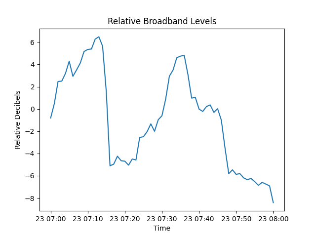

This repository contains scripts for getting/processing data from Orcasound and Ocean Observatories Initiative (OOI) hydrophones and corresponding GitHub Actions workflows.

For introduction to GitHub Actions see [here](https://docs.github.com/en/actions/learn-github-actions/introduction-to-github-actions).

# Orcasound

Orcasound GitHub Actions workflow (located at `.github/workflows/orcasound_processing.yml`) has manual trigger [`dispatch_workflow`](https://docs.github.com/en/actions/managing-workflow-runs/manually-running-a-workflow). It downloads the full timestamp "directory" from Orcasound AWS bucket (see more [here](https://github.com/orcasound/orcadata/blob/master/access.md)) and processes each file individually. For now you will have to manually change timestamp in the workflow file. If you want to change processing from creating spectrograms to something else look for the loop `for input_wav in sorted(glob.glob("wav/*.wav")):` at the end of the source file (`orcasound_processing.py`).

## Orcasound Ambient Sound Visualization

### Broadband Plot

# Ocean Observatories Initiative

Ocean Observatories Initiative GitHub Actions workflow (located at `.github/workflows/ooi_processing.yml`) runs at 12:00 UTC every day (`schedule` event trigger). By default it will attempt to download data in 5 minute length chunks for the previous day and create spectrograms for this data, saving spectrograms in the `spectrograms` directory. These spectrograms are then uploaded as artifacts of the run. In addition to scheduled runs, this workflow can be triggered manually through GitHub web interface, GitHub CLI or REST API (see [here](https://docs.github.com/en/actions/managing-workflow-runs/manually-running-a-workflow)).

Manual workflow runs support setting inputs: node, start time, end time and segment length. Default node is `PC01A`. Segment length can be fractional. To change output directory modify environment variable `OUTPUT_DIR` in the workflow file.

To change processing of the data you will need to modify Python source code (`ooi_processing.py`). Processing loop is in the`save_ooi_spectrograms` function, add your processingsteps after the line `hydrophone_data.wav_write(wav_name)` if you want to work with `.wav` file.
