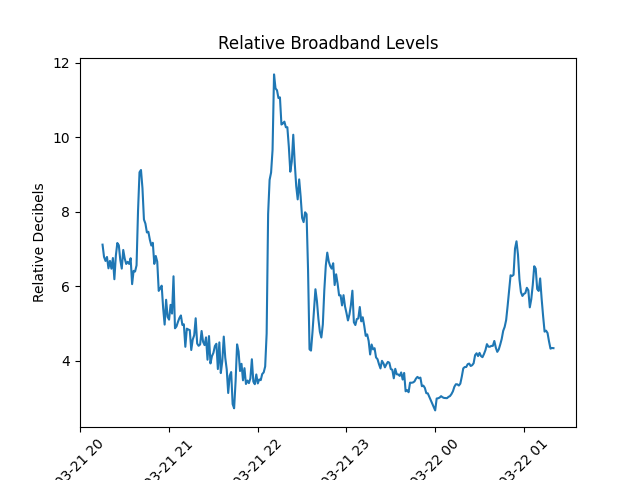
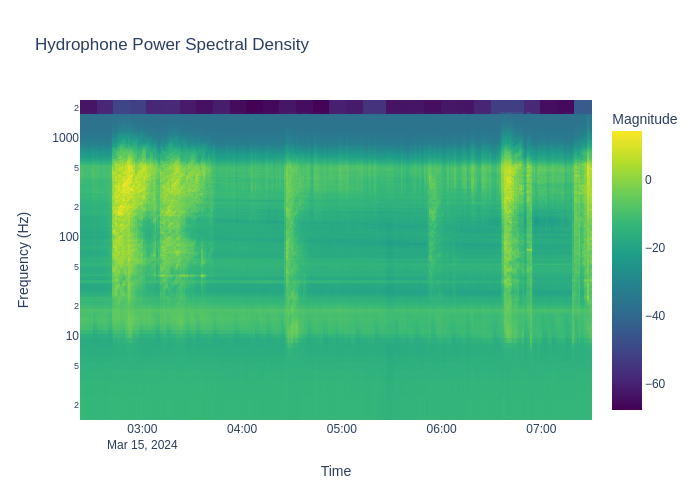

# Github Actions for Orcasound Data Processing

This repository contains:

* Demo scripts for getting/processing data from Orcasound and Ocean Observatories Initiative (OOI) hydrophones and corresponding GitHub Actions workflows.

* Scripts and Github Action workflows for [ambient-sound-analysis](https://github.com/orcasound/ambient-sound-analysis) data processing including generation of PSD and broadband parquet dataframes, rolling ancient ambient calculation, and ship sound metrics.

For introduction to GitHub Actions see [here](https://docs.github.com/en/actions/learn-github-actions/introduction-to-github-actions).

## Demo Github Actions
### Orcasound

Orcasound GitHub Actions workflow (located at `.github/workflows/orcasound_processing.yml`) has manual trigger [`dispatch_workflow`](https://docs.github.com/en/actions/managing-workflow-runs/manually-running-a-workflow). It downloads the full timestamp "directory" from Orcasound AWS bucket (see more [here](https://github.com/orcasound/orcadata/blob/master/access.md)) and processes each file individually. For now you will have to manually change timestamp in the workflow file. If you want to change processing from creating spectrograms to something else look for the loop `for input_wav in sorted(glob.glob("wav/*.wav")):` at the end of the source file (`orcasound_processing.py`).

### Orcasound Ambient Sound Visualization

### Ocean Observatories Initiative

Ocean Observatories Initiative GitHub Actions workflow (located at `.github/workflows/ooi_processing.yml`) runs at 12:00 UTC every day (`schedule` event trigger). By default it will attempt to download data in 5 minute length chunks for the previous day and create spectrograms for this data, saving spectrograms in the `spectrograms` directory. These spectrograms are then uploaded as artifacts of the run. In addition to scheduled runs, this workflow can be triggered manually through GitHub web interface, GitHub CLI or REST API (see [here](https://docs.github.com/en/actions/managing-workflow-runs/manually-running-a-workflow)).

Manual workflow runs support setting inputs: node, start time, end time and segment length. Default node is `PC01A`. Segment length can be fractional. To change output directory modify environment variable `OUTPUT_DIR` in the workflow file.

To change processing of the data you will need to modify Python source code (`ooi_processing.py`). Processing loop is in the`save_ooi_spectrograms` function, add your processingsteps after the line `hydrophone_data.wav_write(wav_name)` if you want to work with `.wav` file.

## Ambient-sound-analysis Github Actions

All ambient-sound-analysis scripts are located in the [ambient-sound-analysis_scripts](./ambient-sound-analysis_scripts/) folder.

### Processing of sound files to PSD and broadband parquet dataframes

This workflow runs the ambient-sound-analysis processing pipeline on hydrophone sound files and outputs PSD parquet dataframes and broadband parquet dataframes. The workflow is scheduled to run every hour to process the most recent hydrophone sound data and save to S3 to create a growing analytical dataset.

* script: `ambient-sound-analysis_scripts/git_action_psd_upload.py`
* workflow: `.github/workflows/scheduled_psd_processing.yml`

### Rolling ambient calculation workflow

This workflow computes a **rolling ancient ambient baseline** by every day calculating the 5th percentile of the prevous 7 days.  
It is intended to record ancient ambient as a reference value for converting broadband and PSD values to decibels and track long-term background sound levels. 

For more information checkout the rolling ambient reference [jupyter notebook](https://github.com/orcasound/ambient-sound-analysis/blob/MSDS-2026-main/notebooks/rolling_ambient_reference.ipynb) in the ambient-sound-analysis repo.

* script: `ambient-sound-analysis_scripts/ambient_reference.py`
* workflow: `.github/workflows/ambient_reference.yml`

### Ship sound metrics workflow

This workflow calculates **ship sound metrics** from processed acoustic data.  
It supports ship-noise monitoring by deriving summary metrics over configured time windows.

* script: `ambient-sound-analysis_scripts/git_action_ship_metrics_upload.py`
* workflow: `.github/workflows/scheduled_ship_metrics_processing.yml`

### Triggering and configuration

Ambient-sound-analysis workflows can be run either:

- on a **schedule** (for routine updates), or
- manually via **workflow_dispatch** (for backfills or custom date ranges)
